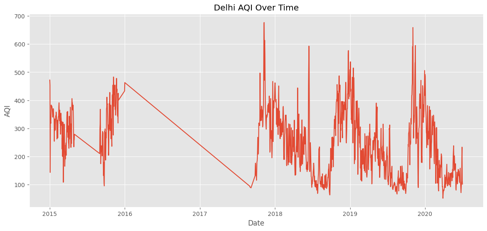
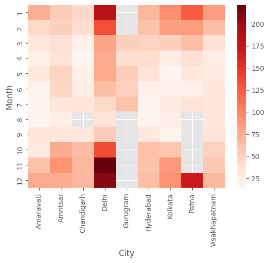
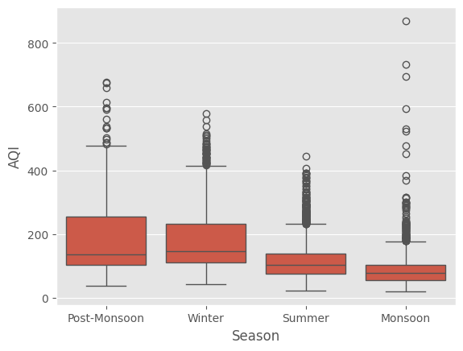

# Air Quality Index (AQI) Analysis of Indian Megacities

## Project Overview

This project analyzes India's air quality trends using real-world pollution data collected across major metropolitan cities.

The analysis focuses on cleaning incomplete sensor readings, engineering meaningful temporal features, and identifying seasonal pollution patterns.

---

## Objectives

- Clean missing sensor data
- Perform exploratory data analysis
- Compare pollution across cities
- Identify seasonal AQI patterns
- Build meaningful visualizations

---

## Dataset

Source:
Kaggle – Air Quality Data in India (2015–2020)

---

## Technologies

- Python
- Pandas
- NumPy
- Matplotlib
- Seaborn

---

## Project Workflow

1. Data Cleaning
2. Missing Value Handling
3. Feature Engineering
4. Exploratory Data Analysis
5. Visualization
6. Insights

---

## Visualizations

### AQI Trend

### PM2.5 Heatmap

### Seasonal Analysis

---

## Key Findings

- Delhi consistently experiences the highest AQI.
- Winter months exhibit severe pollution spikes.
- PM2.5 is the pollutant most strongly correlated with AQI.
- Time-series interpolation effectively restored missing sensor values.
- Southern cities generally maintain better air quality than northern cities.

---

## Future Improvements

- Interactive Plotly Dashboard
- AQI Forecasting using Prophet/LSTM
- Geospatial Mapping
- Real-time AQI API Integration

---

## Author

**Karunya Sharma**

BS in Applied AI & Data Science

IIT Jodhpur
